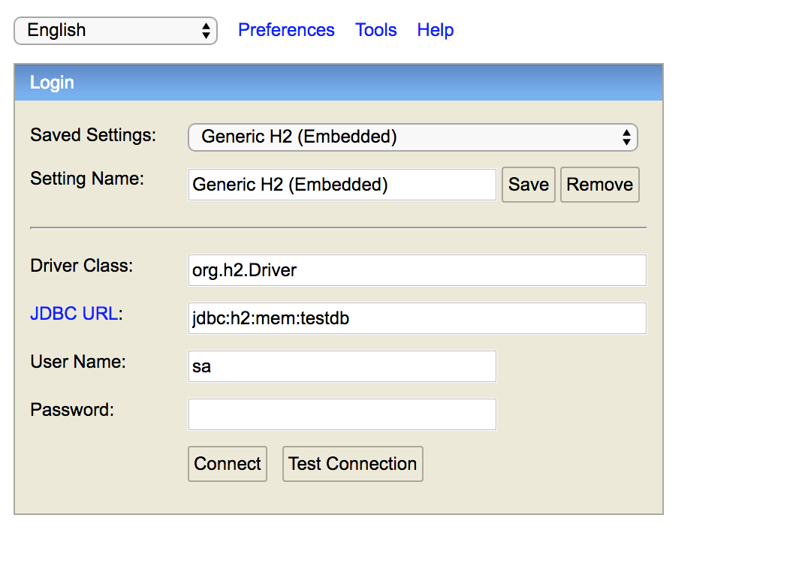

## Before starting
Make sure you have _gradle_ installed. You can use _sdkman_ or follow the instructions from [here](https://gradle.org/install/)

This task is totally **_independent_** of the front end task, even though it is also about questionnaires.
## Run the application
In your command line, go to the project folder and execute `gradle clean build bootRun`.

You can also run the application in your IDE. Go to InterviewApplication.java and run the main method.

## Database access
The application will automatically bring up an H2 in-memory database instance with tables created. However, the tables are all empty and the database is not persistent meaning every time you restart the application, the data will be erased.

You can access the database from your web browser by going to [http://localhost:8080/h2-console](http://localhost:8080/h2-console). Make sure you select the settings the same as the following screening shot and click Connect



## Run the tests
In your command line, go to the project folder and execute `gradle clean build test`

To test your API endpoints, you can use tools such as _Postman._

## Task requirements
In this task, you will be asked to develop the backend to allow users to add, edit, delete, reorder questions in a questionnaire.

The user can add two types of questions, text questions and multi select questions. The multi select questions will have options associated with them. The user can also add, edit, delete and reorder the options.

Your co-worker has developed part of the APIs to operate on text questions. Please take a look at the code to get an idea of the endpoints and the domain objects.

**NOTE** Unlike the front end task (again they are not related), the user can **not** first save the question and then save the options. Instead, when they create the question, they will be posting the whole question object with options in it. Same with editing, deleting and reordering.
The same also applies to options. When the user tries to edit an option, they can only submit the whole question object with updated options in it to the backend.

### Task - Posting Multi Select Questions
Enhance the post endpoint for questions so that it supports creating multi select questions with options

Your client should post a question payload like this to support saving multi select questions
```json
{
  "text": "Question Text",
  "options": [
    {
      "text": "Option Text 1"
    },
    {
      "text": "Option Text 2"
    },
    {
      "text": "Option Text 3"
    }
  ]
}
```

### Bonus Task - Reordering Questions
Design the RESTful endpoint to enable user to send reordering questions requests. Implement controller, service and dao for reordering questions.

## Guideline

1.  Make sure you follow the practice of TDD. You should try to write test cases first. Make sure you have complete test coverage.

2.  Make sure you are using the correct ORM mapping and Hibernate does not issue unnecessary SQLs or generate unnecessary tables. Pay attention to the SQL statements printed out in the console.
